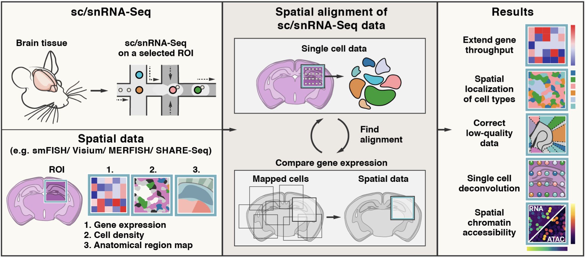
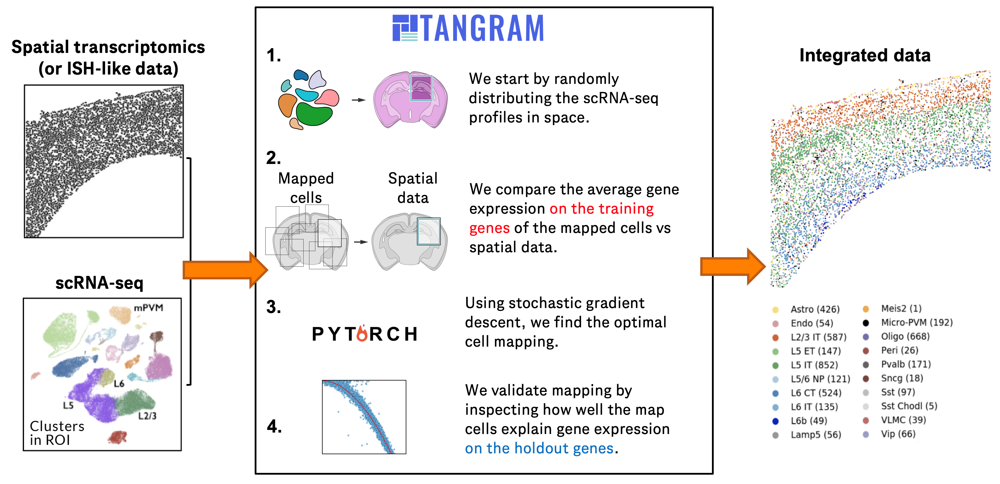

# Tangram
#### Omar Halawa (ohalawa@ucsd.edu) & Julia Kononova (jkononova@ucsd.edu) of the GenePattern Team @ Mesirov Lab - UCSD

## Summary
The following repository is a GPU-enabled GenePattern module of [Tangram](https://github.com/broadinstitute/Tangram) (see [publication](https://www.nature.com/articles/s41592-021-01264-7)), a deep learning method for mapping sc/snRNA-seq data to various forms of spatial data collected from the same anatomical region or tissue type.   

   
## Use Cases
The module can be used for various purposes (all of which are shown in example runs), including: 
- obtaining a spatial localization of cell types **(see image below)**
- extending gene throughput
- correcting low-quality data
- performing single-cell deconvolution

## Implementation   
The module was written in [Python 3.11](https://www.python.org/downloads/release/python-3110/) and uses a Singularity image built from its [Docker counterpart](https://hub.docker.com/layers/omarhalawa/tangram/v1.3/images/sha256-77a432f4d5ebe023e0ed073cb945600dd2f316e14b20aa27cc1f4077cf88f840?context=repo). The same environment can also be replicated using the corresponding [YAML environment file](https://github.com/genepattern/Tangram/blob/develop/tangram_environment.yml). This repository utilizes the code and logic found in the original [Broad Institute Tangram repository](https://github.com/broadinstitute/Tangram).

## Parameters
Detailed documentation on all module parameters can be found [here](/docs/parameters.md).

## Example Data
All source files, including input and output datasets for replicating runs from the original Broad Institute tutorial notebooks ([tutorial_tangram_with_squidpy.ipynb](https://github.com/broadinstitute/Tangram/blob/master/tutorial_tangram_with_squidpy.ipynb) & [tutorial_tangram_without_squidpy.ipynb](https://github.com/broadinstitute/Tangram/blob/master/tutorial_tangram_without_squidpy.ipynb)), can be found through referencing the following [directory](/data/). 

## References   
Biancalani, Tommaso, et al. **“Deep learning and alignment of spatially resolved single-cell transcriptomes with Tangram.”** _Nature Methods_, vol. 18, no. 11, 28 Oct. 2021, pp. 1352–1362.

## Version Comments

| Version | Release Date | Description                                 |
----------|--------------|---------------------------------------------|
| 1.0 | Aug 23, 2024 | Initial version for public use. |
